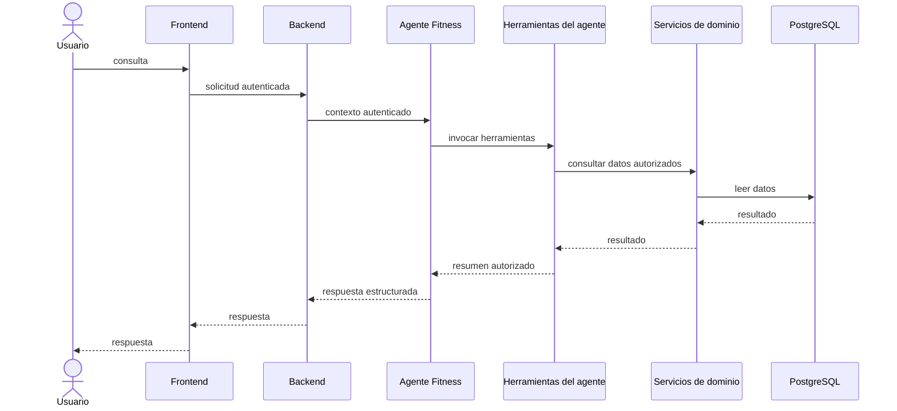
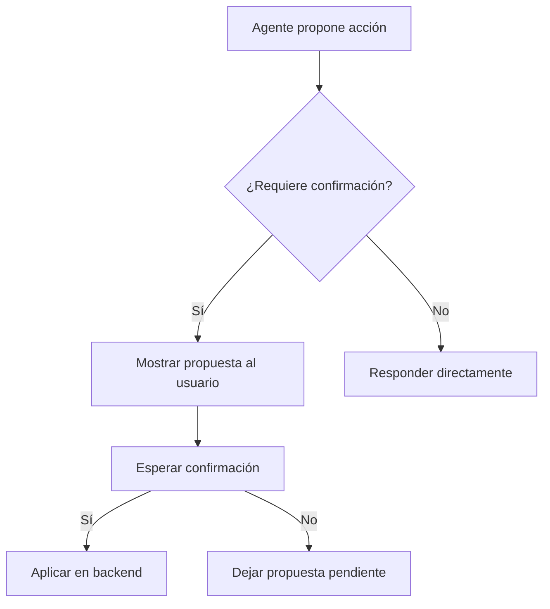
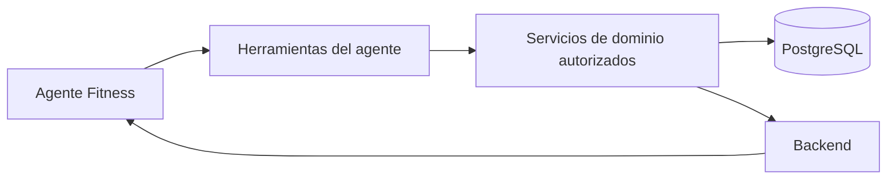

# Diseño del Agente Fitness

## Propósito

Documentar la propuesta conceptual del Agente Fitness como un asistente controlado, explicable y orientado a datos del usuario, sin convertirlo en una fuente de verdad ni en un sistema de automatización irreversible.

## Alcance inicial

El alcance inicial del agente debe limitarse a:

- explicar tendencias y observaciones sobre datos registrados;
- generar borradores de rutina o propuestas de progresión;
- guardar recomendaciones como propuestas, no como cambios aplicados;
- ayudar al usuario a comprender la información disponible.

## Responsabilidades

- Consultar información autorizada a través de herramientas controladas.
- Responder con explicaciones breves, evidencias y contexto.
- Diferenciar entre hechos observables y propuestas.
- Requerir confirmación para acciones sensibles.
- Manejar errores, límites de uso y datos insuficientes.

## Capacidades excluidas

- Diagnóstico médico o clínico.
- Recomendaciones terapéuticas o dietas médicas.
- Modificación automática de datos sensibles.
- Cálculo independiente de métricas que ya deben derivarse de servicios deterministas.
- Acceso directo a SQL o a recursos no autorizados.

## Arquitectura de un único agente

Se propone un único agente orquestador con herramientas limitadas y un flujo claro de consulta, interpretación, generación y validación. Este diseño es una propuesta inicial y no debe interpretarse como una decisión cerrada de implementación.

## Herramientas conceptuales iniciales

### get_user_context

- Objetivo: recuperar el contexto básico del usuario autenticado.
- Tipo de acceso: lectura.
- Entradas conceptuales: contexto autenticado inyectado por el servidor; no un user_id controlado por el modelo.
- Salida conceptual: perfil resumido, objetivos y estado general.
- Controles de autorización: obligatorios.
- Posibles errores: usuario no encontrado, contexto incompleto.
- Requiere confirmación: no.

### get_active_goal

- Objetivo: obtener la meta activa del usuario.
- Tipo de acceso: lectura.
- Entradas conceptuales: contexto autenticado inyectado por el servidor.
- Salida conceptual: meta activa y su estado.
- Controles de autorización: obligatorios.
- Posibles errores: sin meta activa.
- Requiere confirmación: no.

### get_active_routine

- Objetivo: recuperar la rutina activa del usuario.
- Tipo de acceso: lectura.
- Entradas conceptuales: contexto autenticado inyectado por el servidor.
- Salida conceptual: estructura de la rutina activa.
- Controles de autorización: obligatorios.
- Posibles errores: sin rutina activa.
- Requiere confirmación: no.

### get_recent_workouts

- Objetivo: recuperar sesiones recientes del usuario.
- Tipo de acceso: lectura.
- Entradas conceptuales: rango temporal y contexto autenticado inyectado por el servidor.
- Salida conceptual: sesiones recientes y metadatos básicos.
- Controles de autorización: obligatorios.
- Posibles errores: sin datos o contexto insuficiente.
- Requiere confirmación: no.

### get_exercise_history

- Objetivo: consultar el historial de un ejercicio concreto.
- Tipo de acceso: lectura.
- Entradas conceptuales: ejercicio, rango temporal y contexto autenticado inyectado por el servidor.
- Salida conceptual: series, cargas y frecuencia asociadas.
- Controles de autorización: obligatorios.
- Posibles errores: ejercicio inexistente o sin historial.
- Requiere confirmación: no.

### get_weekly_training_volume

- Objetivo: devolver el volumen semanal de entrenamiento.
- Tipo de acceso: cálculo.
- Entradas conceptuales: rango temporal y contexto autenticado inyectado por el servidor.
- Salida conceptual: volumen semanal y contexto de cálculo.
- Controles de autorización: obligatorios.
- Posibles errores: falta de datos suficientes.
- Requiere confirmación: no.

### get_strength_trends

- Objetivo: resumir tendencias de fuerza o progreso.
- Tipo de acceso: cálculo.
- Entradas conceptuales: ejercicio, contexto temporal y contexto autenticado inyectado por el servidor.
- Salida conceptual: tendencia observada y limitaciones del cálculo.
- Controles de autorización: obligatorios.
- Posibles errores: datos insuficientes.
- Requiere confirmación: no.

### get_body_weight_trend

- Objetivo: resumir la evolución del peso corporal.
- Tipo de acceso: cálculo.
- Entradas conceptuales: rango temporal y contexto autenticado inyectado por el servidor.
- Salida conceptual: tendencia de peso y observaciones.
- Controles de autorización: obligatorios.
- Posibles errores: datos insuficientes.
- Requiere confirmación: no.

### get_measurement_comparison

- Objetivo: comparar medidas corporales entre periodos.
- Tipo de acceso: cálculo.
- Entradas conceptuales: periodo o fechas de comparación y contexto autenticado inyectado por el servidor; no un perfil libre como argumento del modelo.
- Salida conceptual: cambios de medidas y contexto de comparación.
- Controles de autorización: obligatorios.
- Posibles errores: sin medidas comparables.
- Requiere confirmación: no.

### get_training_adherence

- Objetivo: devolver una estimación de adherencia del usuario.
- Tipo de acceso: cálculo.
- Entradas conceptuales: periodo y contexto autenticado inyectado por el servidor.
- Salida conceptual: adherencia y supuestos de cálculo.
- Controles de autorización: obligatorios.
- Posibles errores: falta de datos de referencia.
- Requiere confirmación: no.

### get_nutrition_summary

- Objetivo: resumir información nutricional básica.
- Tipo de acceso: cálculo determinista.
- Entradas conceptuales: rango temporal y contexto autenticado inyectado por el servidor.
- Salida conceptual: resumen de calorías y macronutrientes basado en registros autorizados.
- Controles de autorización: obligatorios.
- Posibles errores: sin datos nutricionales.
- Requiere confirmación: no.

### generate_routine_draft

- Objetivo: generar un borrador de rutina revisable.
- Tipo de acceso: generación.
- Entradas conceptuales: contexto del usuario, objetivos y restricciones, con identidad del propietario inyectada por el servidor.
- Salida conceptual: propuesta estructurada de rutina.
- Controles de autorización: obligatorios.
- Posibles errores: restricciones insuficientes o datos incompletos.
- Requiere confirmación: no; generar el borrador no modifica la rutina activa.

### generate_progression_proposal

- Objetivo: generar una propuesta de progresión o ajuste.
- Tipo de acceso: generación.
- Entradas conceptuales: contexto de entrenamiento y evolución, con contexto autenticado inyectado por el servidor.
- Salida conceptual: propuesta con justificación y evidencia.
- Controles de autorización: obligatorios.
- Posibles errores: falta de tendencia o contexto insuficiente.
- Requiere confirmación: no para generar la propuesta; sí para aplicarla.

### generate_weekly_summary

- Objetivo: producir un resumen semanal de progreso.
- Tipo de acceso: generación.
- Entradas conceptuales: rango temporal y contexto autenticado inyectado por el servidor.
- Salida conceptual: resumen breve con observaciones y evidencia.
- Controles de autorización: obligatorios.
- Posibles errores: sin datos suficientes.
- Requiere confirmación: no.

### save_agent_recommendation

- Objetivo: persistir una recomendación propuesta por el agente.
- Tipo de acceso: persistencia.
- Entradas conceptuales: propuesta, contexto, evidencia y estado inicial, con contexto autenticado inyectado por el servidor.
- Salida conceptual: referencia de la recomendación guardada.
- Controles de autorización: obligatorios.
- Posibles errores: formato inválido o falta de contexto.
- Requiere confirmación: no, siempre que no modifique datos de entrenamiento; la aplicación posterior podrá requerirla.

## Autenticación y autorización

El agente no debe recibir un user_id arbitrario del modelo. Debe operar dentro del contexto autenticado que proporciona la aplicación. Todas las herramientas deben aplicar autorización en backend y no asumir que la solicitud del modelo es suficiente.

## Diagrama 1. Flujo de consulta

## Diagrama 2. Flujo de propuesta y confirmación

## Diagrama 3. Límites entre agente, herramientas, servicios de dominio y base de datos

## Contexto enviado al modelo

El contexto debe incluir solo la información necesaria para responder. Debe evitarse enviar datos sensibles más allá de lo requerido y debe preservarse la separación entre hechos y propuestas.

## Salidas estructuradas

La salida conceptual del agente debe incluir:

- summary
- observations
- recommendations
- evidence
- missing_information
- confidence
- requires_confirmation

## Evidencias

Cada recomendación o observación debe venir acompañada de evidencia concreta extraída del contexto y de los datos disponibles. No se deben inventar registros ni métricas.

## Nivel de confianza

El nivel de confianza no debe representar una autovaloración del modelo. Debe limitarse o calcularse considerando la disponibilidad de datos, la calidad de la evidencia, la completitud temporal, los errores de herramientas y las reglas deterministas aplicables.

## Confirmaciones

Las acciones sensibles deben requerir confirmación explícita. Esto incluye, por ejemplo, activar una rutina, modificar objetivos, aplicar progresiones, eliminar registros o editar historial. Estas operaciones futuras serán herramientas o endpoints separados y requerirán confirmación explícita.

## Persistencia

El agente puede persistir recomendaciones o borradores, pero no debe modificar datos sensibles automáticamente. La persistencia debe estar supervisada por el backend y por las reglas de negocio.

## Errores y timeouts

- Errores de herramienta: deben devolverse como errores controlados.
- Timeouts del modelo: deben expresarse como falta de respuesta o respuesta parcial.
- Límites de uso: deben evitar que el agente abuse del sistema.
- Trazabilidad: cada interacción debe quedar registrada sin exponer datos innecesarios.

## Pruebas y evaluaciones

Las pruebas normales del agente no deben depender de llamadas reales a OpenAI. Se prevén evaluaciones específicas para:

- selección de herramientas;
- factualidad y evidencia;
- guardrails y seguridad;
- manejo de datos insuficientes.

## Decisiones pendientes

- Definir la política concreta de contexto y límites de tokens.
- Formalizar las capacidades de cada herramienta y su grado de autorización.
- Decidir cómo se hará la trazabilidad de las interacciones del agente.
- Determinar la estrategia de evaluaciones automáticas y humanas.
