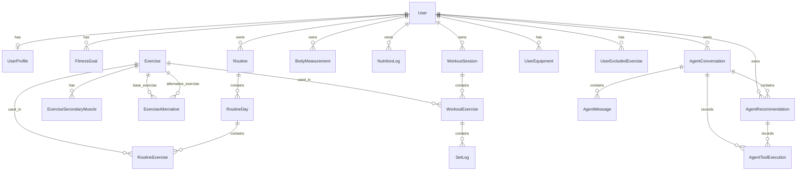

# Modelo de datos conceptual

## Propósito

Documentar el modelo conceptual de dominio de Agente Fitness, manteniendo el foco en la estructura lógica del producto y en las reglas de propiedad, historial y privacidad.

## Alcance

Este documento describe las entidades y relaciones conceptuales necesarias
para soporte del MVP inicial. Únicamente `User` está implementada en el bloque
3A.1; el resto continúa siendo diseño futuro y no representa tablas
existentes.

## Principios del modelo

- El modelo debe reflejar el dominio de entrenamiento, progresión, rutinas, medidas y asistencia.
- Los datos históricos deben conservarse de forma estable.
- La propiedad debe ser explícita para cada entidad relevante.
- Las entidades sensibles deben incorporar reglas de privacidad y autorización.
- Las fechas de calendario deben separarse de los timestamps.
- Los timestamps deben manejarse en UTC.
- Las agregaciones temporales deben respetar la zona horaria del usuario.

## Entidades y relaciones conceptuales

## Entidades mínimas

### User

- Propósito: representar la identidad principal del usuario del sistema.
- Campos implementados: id UUID, email normalizado, password_hash, is_active,
  created_at y updated_at.
- Relaciones: posee un perfil como máximo, objetivos, rutinas, sesiones, medidas, conversaciones y recomendaciones.
- Reglas de propiedad: cada usuario es propietario de sus datos privados.
- Restricciones implementadas: clave primaria `pk_users`, correo no nulo y
  restricción única `uq_users_email`; todos los campos son no nulos.
- Ciclo de vida implementado: creación y activación o desactivación. No existe
  soft delete en esta fase.
- Privacidad: el hash solo pertenece a persistencia y nunca forma parte de un
  esquema de salida.

Los timestamps se almacenan con zona horaria y se generan en UTC. La
normalización del correo elimina espacio exterior y aplica una comparación
consistente sin distinguir mayúsculas. No se añadió un índice separado porque
la restricción única de PostgreSQL ya proporciona el acceso necesario para
login y detección de duplicados.

### UserProfile

- Propósito: almacenar datos básicos de identidad y contexto físico del usuario.
- Campos conceptuales principales: display_name, birth_date, height, timezone, units_preference.
- Relaciones: pertenece a un solo User.
- Reglas de propiedad: propiedad exclusiva del usuario.
- Restricciones relevantes: un perfil por usuario.
- Ciclo de vida: creado al completar la inscripción y actualizado según el usuario.
- Nota: datos fisiológicos adicionales, si se incorporan más adelante, deben quedar como decisión pendiente y sujetarse a minimización y justificación.

### UserEquipment

- Propósito: registrar equipos disponibles para el usuario.
- Campos conceptuales principales: equipment_type, availability_status.
- Relaciones: pertenece a un usuario.
- Reglas de propiedad: propiedad del usuario.
- Restricciones relevantes: debe ser coherente con el catálogo de ejercicios.
- Ciclo de vida: creado, actualizado o eliminado conforme al contexto del usuario.

### FitnessGoal

- Propósito: representar metas concretas del usuario.
- Campos conceptuales principales: goal_type, target_value, target_date, status, notes.
- Relaciones: pertenece a un usuario.
- Reglas de propiedad: propiedad del usuario.
- Restricciones relevantes: una meta activa por usuario puede ser el caso inicial, aunque el modelo debe dejar abierta la posibilidad de varias metas en el futuro.
- Ciclo de vida: activa, completada, cancelada o archivada.

### Exercise

- Propósito: representar ejercicios del catálogo global o personalizados.
- Campos conceptuales principales: id, name, description, movement_pattern, primary_muscle_group, is_global, created_by_user_id.
- Relaciones: puede aparecer en rutinas y sesiones; puede tener músculos secundarios y alternativas.
- Reglas de propiedad: los ejercicios globales no son modificables por usuarios normales; los personalizados pertenecen a su creador.
- Restricciones relevantes: el catálogo debe distinguir entre global y personalizado.
- Ciclo de vida: activo, archivado o eliminado.

### ExerciseSecondaryMuscle

- Propósito: registrar músculos secundarios asociados a un ejercicio.
- Campos conceptuales principales: exercise_id, muscle_group.
- Relaciones: pertenece a un Exercise.
- Reglas de propiedad: depende del ejercicio.
- Restricciones relevantes: debe ser coherente con el ejercicio padre.
- Ciclo de vida: creado y eliminado junto con el ejercicio.

### ExerciseAlternative

- Propósito: registrar alternativas de ejercicio para un ejercicio base.
- Campos conceptuales principales: base_exercise_id, alternative_exercise_id, rationale.
- Relaciones: representa una relación entre un ejercicio base y un ejercicio alternativo.
- Reglas de propiedad: depende del catálogo y del ejercicio base.
- Restricciones relevantes: no deben existir autorreferencias directas ni duplicados en la misma pareja; una relación recíproca puede ser válida si se documenta de forma explícita.
- Ciclo de vida: creado, actualizado o eliminado con el ejercicio base.

### UserExcludedExercise

- Propósito: registrar ejercicios excluidos por un usuario.
- Campos conceptuales principales: user_id, exercise_id, reason, created_at.
- Relaciones: pertenece a un usuario y a un ejercicio.
- Reglas de propiedad: propiedad del usuario.
- Restricciones relevantes: debe respetar el catálogo del sistema.
- Ciclo de vida: creado y eliminado por el usuario o por reglas de negocio.

### Routine

- Propósito: representar una estructura planificada de entrenamiento.
- Campos conceptuales principales: id, user_id, name, is_active, start_date, notes, created_at, updated_at.
- Relaciones: tiene varios RoutineDay, varios RoutineExercise y puede existir como versión o plantilla.
- Reglas de propiedad: propiedad del usuario.
- Restricciones relevantes: solo una rutina activa por usuario.
- Ciclo de vida: draft, active, archived, deleted.

### RoutineDay

- Propósito: representar un bloque de planificación dentro de una rutina.
- Campos conceptuales principales: routine_id, name, position, estimated_duration, notes.
- Relaciones: pertenece a una Routine y contiene RoutineExercise.
- Reglas de propiedad: depende de la rutina.
- Restricciones relevantes: no debe requerirse necesariamente un día de la semana; la asociación con días concretos del calendario queda como decisión pendiente.
- Ciclo de vida: creado y actualizado según la rutina.

### RoutineExercise

- Propósito: registrar ejercicios planificados dentro de una rutina.
- Campos conceptuales principales: routine_day_id, exercise_id, target_sets, target_reps, target_load, rir_or_rpe, notes.
- Relaciones: pertenece a un RoutineDay y a un Exercise.
- Reglas de propiedad: depende de la rutina del usuario.
- Restricciones relevantes: su estado histórico debe preservarse incluso si cambian las cargas o las series previstas.
- Ciclo de vida: creado, editado o eliminado sin modificar automáticamente sesiones pasadas.

### WorkoutSession

- Propósito: representar una sesión real de entrenamiento.
- Campos conceptuales principales: id, user_id, started_at, finished_at, notes, source_routine_id, status.
- Relaciones: contiene WorkoutExercise y depende del usuario.
- Reglas de propiedad: propiedad del usuario.
- Restricciones relevantes: los datos históricos deben ser estables y no alterarse por cambios posteriores en la rutina.
- Ciclo de vida: iniciado, en progreso, completado, cancelado.

### WorkoutExercise

- Propósito: representar los ejercicios realizados dentro de una sesión.
- Campos conceptuales principales: workout_session_id, planned_exercise_id, executed_exercise_id, routine_exercise_id, position, substitution_indicator, substitution_reason, notes.
- Relaciones: pertenece a una WorkoutSession y a un Exercise; contiene SetLog.
- Reglas de propiedad: propiedad del usuario y del historial de la sesión.
- Restricciones relevantes: debe preservar el contexto de los ejercicios realmente ejecutados y diferenciar entre ejercicio planificado y realizado. Puede existir un ejercicio añadido manualmente que no proceda de una rutina.
- Ciclo de vida: creado y cerrado con la sesión.

### SetLog

- Propósito: registrar series realizadas en una sesión.
- Campos conceptuales principales: workout_exercise_id, set_number, set_type, load, reps, rir_or_rpe, status, planned_values, recorded_at.
- Relaciones: pertenece a WorkoutExercise.
- Reglas de propiedad: propiedad del usuario y del historial de la sesión.
- Restricciones relevantes: debe conservarse incluso si la rutina cambia y debe registrar el estado completado o fallido.
- Ciclo de vida: creado y no alterado una vez finalizado el registro.

### BodyMeasurement

- Propósito: almacenar mediciones corporales del usuario.
- Campos conceptuales principales: user_id, measurement_date, weight, body_fat, waist, chest, arm, hip, thigh.
- Relaciones: pertenece a un usuario.
- Reglas de propiedad: propiedad del usuario.
- Restricciones relevantes: la fecha de calendario debe separarse del timestamp de registro.
- Ciclo de vida: creado, actualizado o eliminado según la intención del usuario.

### NutritionLog

- Propósito: registrar datos nutricionales básicos.
- Campos conceptuales principales: user_id, log_date, calories, protein, carbohydrates, fat, notes, created_at, updated_at.
- Relaciones: pertenece a un usuario.
- Reglas de propiedad: propiedad del usuario.
- Restricciones relevantes: el uso de datos nutricionales debe mantenerse en un alcance básico.
- Ciclo de vida: creado, actualizado o eliminado por el usuario.

### AgentConversation

- Propósito: representar una conversación con el Agente Fitness.
- Campos conceptuales principales: id, user_id, created_at, status, context_summary.
- Relaciones: contiene mensajes, recomendaciones y ejecuciones de herramientas.
- Reglas de propiedad: propiedad del usuario.
- Restricciones relevantes: no deben almacenarse razonamientos internos del modelo.
- Ciclo de vida: activa, cerrada o archivada.

### AgentMessage

- Propósito: registrar mensajes del usuario o del agente dentro de una conversación.
- Campos conceptuales principales: conversation_id, role, content, created_at.
- Relaciones: pertenece a una AgentConversation.
- Reglas de propiedad: depende de la conversación del usuario.
- Restricciones relevantes: pueden almacenarse mensajes visibles del usuario y respuestas visibles del agente, pero no prompts del sistema, instrucciones internas ni razonamiento interno del modelo por defecto.
- Ciclo de vida: creado y conservado por la conversación.

### AgentRecommendation

- Propósito: registrar recomendaciones generadas para el usuario.
- Campos conceptuales principales: id, user_id, conversation_id, recommendation_type, summary, evidence, requires_confirmation, status.
- Relaciones: pertenece a un usuario y a una conversación; puede tener varias ejecuciones de herramienta.
- Reglas de propiedad: propiedad del usuario y de la conversación.
- Restricciones relevantes: debe guardar evidencia y no inventar registros.
- Ciclo de vida: creada, pendiente, aceptada, rechazada o expirada.

### AgentToolExecution

- Propósito: registrar ejecuciones de herramientas del agente.
- Campos conceptuales principales: conversation_id, recommendation_id, tool_name, input_summary, output_summary, started_at, completed_at, status, error_code.
- Relaciones: pertenece como mínimo a una AgentConversation y, si procede, a una AgentRecommendation.
- Reglas de propiedad: propiedad del contexto del agente y del usuario.
- Restricciones relevantes: minimizar datos personales en las ejecuciones y evitar almacenar secretos. La vinculación opcional a un mensaje o recomendación queda como decisión pendiente.
- Ciclo de vida: ejecutada, completada o fallida.

## Propiedad de los datos

- Los datos de usuario son privados para ese usuario.
- Los ejercicios globales y los datos compartidos se gestionan como recursos del sistema, pero no deben ser editados por usuarios normales si son globales.
- Las recomendaciones, mensajes y conversaciones pertenecen al usuario que las originó o al contexto autenticado.

## Restricciones

- Correo único.
- Un perfil por usuario.
- Solo una rutina activa por usuario.
- Ejercicios globales no modificables por usuarios normales.
- Ejercicios personalizados propiedad de su creador.
- Datos históricos de entrenamientos estables.
- Una edición posterior de la rutina no debería alterar sesiones anteriores.
- Recomendaciones con evidencia y sin razonamiento interno del modelo.

## Ciclos de vida

- Routine: draft, active, archived, deleted.
- WorkoutSession: planned, in_progress, completed, cancelled.
- AgentRecommendation: pending, accepted, rejected, expired.
- Exercise: active, archived, deleted.

## Integridad histórica

El contexto histórico debe preservarse para:

- una sesión terminada conserva su contexto;
- el ejercicio realizado no cambia si cambia el catálogo;
- los valores reales de cada serie permanecen estables;
- debe conservarse la diferencia entre ejercicio planificado y realizado;
- debe conservarse cualquier sustitución;
- los cambios posteriores en una rutina no alteran sesiones pasadas.

La estrategia exacta entre copia completa, snapshot parcial o versionado debe dejarse como decisión pendiente.

## Privacidad de conversaciones y mensajes

- El contenido visible del usuario y la respuesta visible del agente pueden almacenarse conforme a la política de retención, finalidad y consentimiento.
- Los prompts del sistema, las instrucciones internas y los payloads completos de herramientas no se almacenarán por defecto.
- Los argumentos y resultados completos de herramientas no se registrarán por defecto.
- El razonamiento interno del modelo no se almacenará.

## Fechas y zonas horarias

- Los timestamps se manejarán en UTC.
- Las fechas de calendario, como birth_date, measurement_date o log_date, se almacenarán como fechas y no se convertirán implícitamente a UTC.
- Las agregaciones y comparaciones deben respetar la zona horaria del usuario.

## Unidades internas

- Masa: kilogramos.
- Longitud: centímetros.
- Duración: segundos.
- Energía alimentaria: kilocalorías.
- Líquidos: mililitros.

## Borrado, archivado y retención

- El borrado debe distinguir entre borrado visible para el usuario, borrado lógico y borrado físico.
- El archivado debe separar el contenido activo del contenido histórico.
- La política final de retención debe dejarse como decisión pendiente.

## Datos derivados

Los siguientes datos pueden tratarse como derivados o calculados:

- volumen semanal;
- adherencia;
- tendencias de peso;
- comparación de medidas;
- frecuencia por grupo muscular;
- estimaciones de progreso.

Estos valores deben derivarse de servicios deterministas y no se deben asumir como fuente principal de verdad frente a los datos históricos.

## Auditoría

Se debe dejar un registro conceptual de quién hizo qué cambio, cuándo y con qué contexto. La auditoría debe limitarse a lo necesario y respetar los principios de privacidad.

## Índices conceptuales

- índice por user_id en datos privados;
- índice por created_at en conversaciones y registros temporales;
- índice por status en recomendaciones y sesiones;
- índice por exercise_id en tablas relacionadas con ejercicios.

## Decisiones pendientes

- Definir la estrategia precisa de versionado o snapshot para rutinas y sesiones históricas.
- Determinar la política final de retención y borrado.
- Formalizar la estructura de auditoría y trazabilidad.
- Decidir si se almacenan resúmenes derivados o se calculan en tiempo real.
