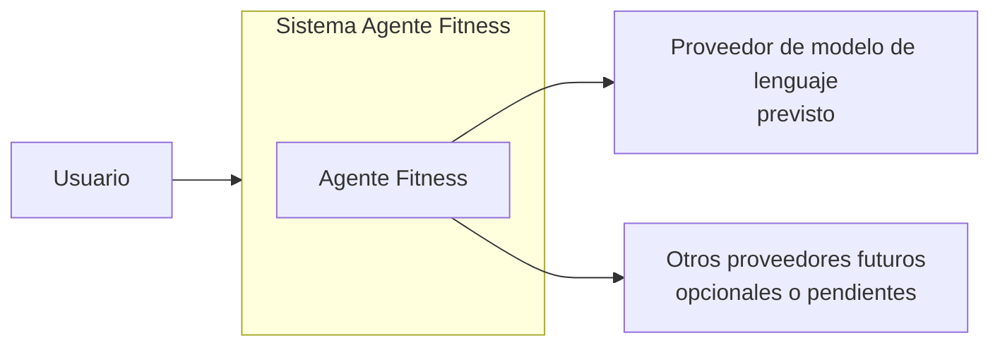
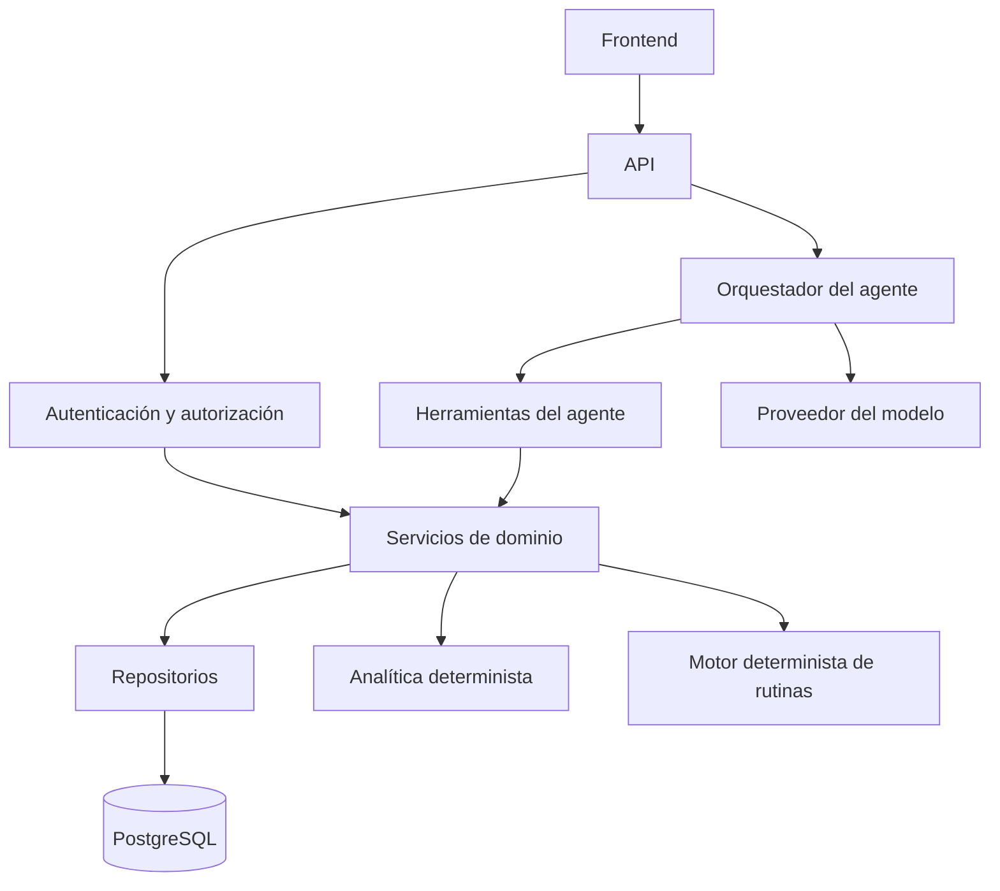
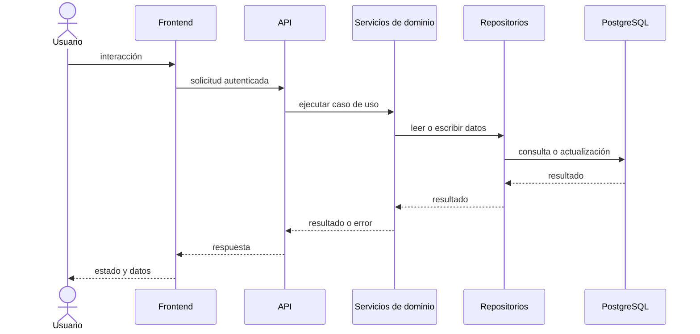
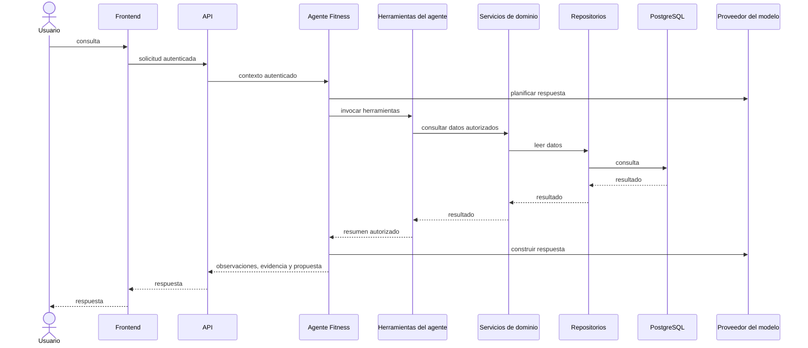

# Arquitectura general prevista

## Estado del documento

Este documento describe la arquitectura prevista para Agente Fitness como una propuesta documental previa a la implementación. Las tecnologías listadas aquí están planificadas y deberán respaldarse con ADR antes de considerarse decisiones arquitectónicas cerradas.

## Objetivos arquitectónicos

- Mantener una separación clara entre interfaz, API, dominio, persistencia y agente.
- Permitir un desarrollo incremental sin asumir que todas las capacidades están ya implementadas.
- Asegurar que los cálculos importantes se realicen mediante servicios deterministas.
- Respetar los principios de privacidad, seguridad, trazabilidad y control del usuario.
- Preparar una base que permita evolucionar hacia un MVP verificable.

## Contexto del sistema

Agente Fitness es una propuesta de producto orientada a registrar entrenamientos, rutinas, medidas, metas y contexto nutricional, y a ofrecer explicaciones y propuestas guiadas por un agente asistente. El sistema debe servir a un usuario autenticado, conservar datos históricos y exponer una API controlada para la interfaz y el agente.

## Actores y sistemas externos

- Usuario final: registra datos, consulta métricas y revisa propuestas.
- Frontend web: presenta la experiencia de usuario y se comunica con el backend.
- Backend API: expone operaciones de negocio y aplica autorización.
- Base de datos relacional: almacena datos persistentes y soporta consultas estructuradas.
- Agente Fitness: consulta datos autorizados, genera explicaciones y propuestas, y persiste recomendaciones cuando corresponde.
- Sistemas externos potenciales: proveedores de autenticación, servicios de email, almacenamiento externo o modelos de lenguaje. Estos no forman parte del MVP inicial y deben tratarse como decisiones pendientes.

## Diagrama 1. Contexto del sistema

## Componentes principales

- Frontend: propuesta de interfaz web orientada a una experiencia mobile-first.
- Backend: propuesta de API con rutas, esquemas, servicios de dominio, repositorios y lógica de control.
- Persistencia: PostgreSQL como base de trabajo futuro, con SQLAlchemy y Alembic como opciones por confirmar.
- Analítica determinista: servicios independientes de cálculo de métricas.
- Motor determinista de rutinas: lógica explícita para generar borradores de rutina.
- Agente Fitness: un único agente orquestador con herramientas limitadas.

## Diagrama 2. Componentes principales

## Responsabilidades del frontend

- Presentar pantallas y flujos de producto.
- Recoger datos de entrada del usuario.
- Mostrar estados de carga, vacío, error y confirmación.
- Consumir la API backend.
- No acceder directamente a PostgreSQL ni al proveedor de IA.
- No almacenar secretos ni credenciales de acceso.

## Responsabilidades del backend

- Exponer una API coherente y autorizada.
- Aplicar reglas de negocio y autorización.
- Coordinar servicios de dominio y repositorios.
- Mantener la lógica de negocio fuera de los endpoints.
- Ejecutar validaciones y manejar errores de negocio.
- Servir de intermediario entre frontend, analítica determinista, motor de rutinas y agente.

## Responsabilidades de PostgreSQL

- Persistir datos estructurados del sistema.
- Mantener relaciones entre usuarios, rutinas, sesiones, medidas y recomendaciones.
- Soportar consultas transaccionales y consistencia básica.
- No ser accedido directamente por el frontend ni por el Agente Fitness.

## Analítica determinista

La analítica determinista debe ser un servicio independiente del agente. Sus responsabilidades incluyen calcular métricas de volumen, adherencia, progresión, frecuencia, tendencias y comparaciones según reglas explícitas. Estas métricas no deben delegarse al modelo de lenguaje.

## Motor determinista de rutinas

El motor determinista de rutinas debe construir borradores de rutina con reglas explícitas basadas en contexto del usuario, objetivos, ejercicios disponibles y restricciones conocidas. Debe producir una salida revisable y no activarla automáticamente.

## Agente Fitness

El Agente Fitness es una capa de asistencia orientada a explicar datos y generar propuestas verificables. Debe usar herramientas internas autorizadas, no tener acceso SQL directo y no recibir un user_id arbitrario del modelo. Su propósito es apoyar la comprensión de los datos y la toma de decisiones del usuario, no sustituir su criterio.

## Diagrama 3. Flujo de una petición normal

## Diagrama 4. Flujo de una consulta al Agente Fitness

## Separación entre lógica de negocio, persistencia y API

- Los endpoints deben permanecer delgados y no albergar lógica de negocio compleja.
- La lógica de negocio debe residir en servicios de dominio o módulos equivalentes.
- La persistencia debe encapsularse en repositorios o capas de acceso a datos.
- El agente debe usar herramientas controladas y no acceder a la base de datos directamente.

## Límites de confianza

- El frontend no es de confianza para autorización ni para integridad de datos.
- El backend es la capa de control y debe validar todas las operaciones sensibles.
- El modelo de lenguaje no es una fuente de verdad; solo una capa de interpretación y generación.
- La base de datos es la fuente principal de persistencia y debe tratarse como autoridad de datos.

## Dependencias externas

- Modelo de lenguaje externo, si se habilita en un futuro.
- Proveedores externos de autenticación, email o almacenamiento, si se deciden en una fase posterior.
- Herramientas de observabilidad y monitoreo, cuando el sistema avance.

## Observabilidad prevista

Se prevé registrar eventos relevantes de solicitud, autorización, errores, ejecución de herramientas y decisiones de negocio. La observabilidad debe respetar la privacidad y evitar registrar información personal innecesaria.

## Despliegue conceptual

La arquitectura propuesta se concibe como un sistema desplegable en entorno de desarrollo y producción con una separación clara entre frontend, backend, base de datos y servicios auxiliares. Docker Compose se considera una herramienta de entorno local planificada, no una configuración existente.

## Decisiones pendientes

- Definir de forma formal si React con TypeScript y FastAPI serán las tecnologías definitivas.
- Decidir si SQLAlchemy y Alembic se adoptan como base de persistencia.
- Formalizar cómo se gestionarán autenticación, autorización y secretos.
- Definir la estrategia concreta de observabilidad y trazabilidad.
- Decidir la forma exacta de integrar el OpenAI Agents SDK, si se autoriza su uso.
- Determinar la política de despliegue y entorno de ejecución.

## Riesgos arquitectónicos

- Sobrecomplicar la arquitectura antes de tener un MVP claro.
- Mezclar lógica de negocio en la API.
- Delegar métricas importantes en el modelo en lugar de mantener servicios deterministas.
- Permitir que el agente acceda a datos sensibles sin controles estrictos.
- Introducir dependencias externas sin una política clara de privacidad y seguridad.
